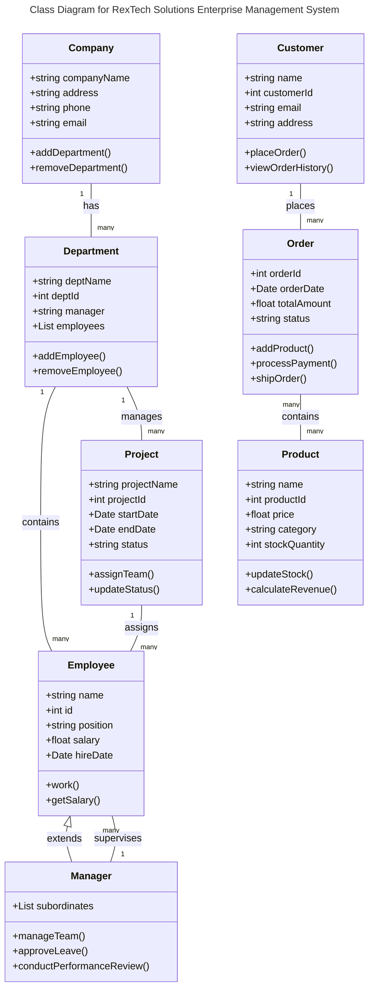

# Class Diagram 

```mermaid
---
title: Class Diagram for RexTech Solutions Enterprise Management System
---
classDiagram
    class Company {
        +string companyName
        +string address
        +string phone
        +string email
        +addDepartment()
        +removeDepartment()
    }

    class Department {
        +string deptName
        +int deptId
        +string manager
        +List<Employee> employees
        +addEmployee()
        +removeEmployee()
    }

    class Employee {
        +string name
        +int id
        +string position
        +float salary
        +Date hireDate
        +work()
        +getSalary()
    }

    class Manager {
        +List<Employee> subordinates
        +manageTeam()
        +approveLeave()
        +conductPerformanceReview()
    }

    class Project {
        +string projectName
        +int projectId
        +Date startDate
        +Date endDate
        +string status
        +assignTeam()
        +updateStatus()
    }

    class Product {
        +string name
        +int productId
        +float price
        +string category
        +int stockQuantity
        +updateStock()
        +calculateRevenue()
    }

    class Order {
        +int orderId
        +Date orderDate
        +float totalAmount
        +string status
        +addProduct()
        +processPayment()
        +shipOrder()
    }

    class Customer {
        +string name
        +int customerId
        +string email
        +string address
        +placeOrder()
        +viewOrderHistory()
    }

    Company "1" -- "many" Department : has
    Department "1" -- "many" Employee : contains
    Employee <|-- Manager : extends
    Department "1" -- "many" Project : manages
    Project "1" -- "many" Employee : assigns
    Customer "1" -- "many" Order : places
    Order "many" -- "many" Product : contains
    Manager "1" -- "many" Employee : supervises
```