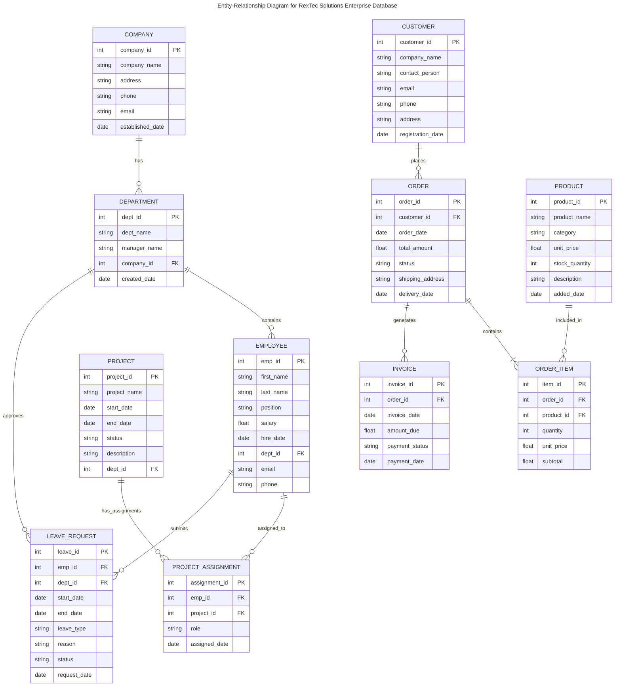

# Database Diagram 

```mermaid
---
title: Entity-Relationship Diagram for RexTec Solutions Enterprise Database
---
erDiagram
    COMPANY ||--o{ DEPARTMENT : has
    DEPARTMENT ||--o{ EMPLOYEE : contains
    EMPLOYEE ||--o{ PROJECT_ASSIGNMENT : assigned_to
    PROJECT ||--o{ PROJECT_ASSIGNMENT : has_assignments
    CUSTOMER ||--o{ ORDER : places
    ORDER ||--|{ ORDER_ITEM : contains
    PRODUCT ||--o{ ORDER_ITEM : included_in
    ORDER ||--o{ INVOICE : generates
    EMPLOYEE ||--o{ LEAVE_REQUEST : submits
    DEPARTMENT ||--o{ LEAVE_REQUEST : approves

    COMPANY {
        int company_id PK
        string company_name
        string address
        string phone
        string email
        date established_date
    }

    DEPARTMENT {
        int dept_id PK
        string dept_name
        string manager_name
        int company_id FK
        date created_date
    }

    EMPLOYEE {
        int emp_id PK
        string first_name
        string last_name
        string position
        float salary
        date hire_date
        int dept_id FK
        string email
        string phone
    }

    PROJECT {
        int project_id PK
        string project_name
        date start_date
        date end_date
        string status
        string description
        int dept_id FK
    }

    PROJECT_ASSIGNMENT {
        int assignment_id PK
        int emp_id FK
        int project_id FK
        string role
        date assigned_date
    }

    CUSTOMER {
        int customer_id PK
        string company_name
        string contact_person
        string email
        string phone
        string address
        date registration_date
    }

    PRODUCT {
        int product_id PK
        string product_name
        string category
        float unit_price
        int stock_quantity
        string description
        date added_date
    }

    ORDER {
        int order_id PK
        int customer_id FK
        date order_date
        float total_amount
        string status
        string shipping_address
        date delivery_date
    }

    ORDER_ITEM {
        int item_id PK
        int order_id FK
        int product_id FK
        int quantity
        float unit_price
        float subtotal
    }

    INVOICE {
        int invoice_id PK
        int order_id FK
        date invoice_date
        float amount_due
        string payment_status
        date payment_date
    }

    LEAVE_REQUEST {
        int leave_id PK
        int emp_id FK
        int dept_id FK
        date start_date
        date end_date
        string leave_type
        string reason
        string status
        date request_date
    }
```