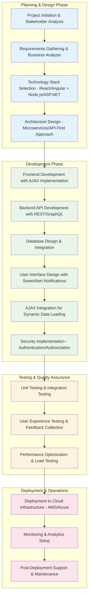

# Development Strategy 

```mermaid
flowchart TD
    A[Project Initiation & Stakeholder Analysis] --> B[Requirements Gathering & Business Analysis]
    B --> C[Technology Stack Selection - React/Angular + Node.js/ASP.NET]
    C --> D[Architecture Design - Microservices/API-First Approach]
    D --> E[Frontend Development with AJAX Implementation]
    E --> F[Backend API Development with REST/GraphQL]
    F --> G[Database Design & Integration]
    G --> H[User Interface Design with SweetAlert Notifications]
    H --> I[AJAX Integration for Dynamic Data Loading]
    I --> J[Security Implementation - Authentication/Authorization]
    J --> K[Unit Testing & Integration Testing]
    K --> L[User Experience Testing & Feedback Collection]
    L --> M[Performance Optimization & Load Testing]
    M --> N[Deployment to Cloud Infrastructure - AWS/Azure]
    N --> O[Monitoring & Analytics Setup]
    O --> P[Post-Deployment Support & Maintenance]

    subgraph "Planning & Design Phase"
        A
        B
        C
        D
    end

    subgraph "Development Phase"
        E
        F
        G
        H
        I
        J
    end

    subgraph "Testing & Quality Assurance"
        K
        L
        M
    end

    subgraph "Deployment & Operations"
        N
        O
        P
    end

    style A fill:#e3f2fd
    style B fill:#e3f2fd
    style C fill:#e3f2fd
    style D fill:#e3f2fd
    style E fill:#e8f5e8
    style F fill:#e8f5e8
    style G fill:#e8f5e8
    style H fill:#e8f5e8
    style I fill:#e8f5e8
    style J fill:#e8f5e8
    style K fill:#fff3e0
    style L fill:#fff3e0
    style M fill:#fff3e0
    style N fill:#fce4ec
    style O fill:#fce4ec
    style P fill:#fce4ec
```