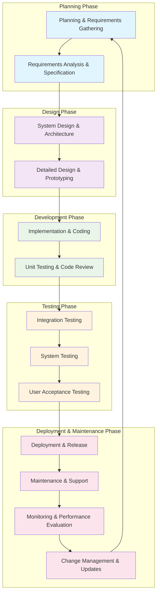

# Software Development Life Cycle

```mermaid
flowchart TD
    A[Planning & Requirements Gathering] --> B[Requirements Analysis & Specification]
    B --> C[System Design & Architecture]
    C --> D[Detailed Design & Prototyping]
    D --> E[Implementation & Coding]
    E --> F[Unit Testing & Code Review]
    F --> G[Integration Testing]
    G --> H[System Testing]
    H --> I[User Acceptance Testing]
    I --> J[Deployment & Release]
    J --> K[Maintenance & Support]
    K --> L[Monitoring & Performance Evaluation]
    L --> M[Change Management & Updates]
    M --> A

    subgraph "Planning Phase"
        A
        B
    end

    subgraph "Design Phase"
        C
        D
    end

    subgraph "Development Phase"
        E
        F
    end

    subgraph "Testing Phase"
        G
        H
        I
    end

    subgraph "Deployment & Maintenance Phase"
        J
        K
        L
        M
    end

    style A fill:#e1f5fe
    style B fill:#e1f5fe
    style C fill:#f3e5f5
    style D fill:#f3e5f5
    style E fill:#e8f5e8
    style F fill:#e8f5e8
    style G fill:#fff3e0
    style H fill:#fff3e0
    style I fill:#fff3e0
    style J fill:#fce4ec
    style K fill:#fce4ec
    style L fill:#fce4ec
    style M fill:#fce4ec
```